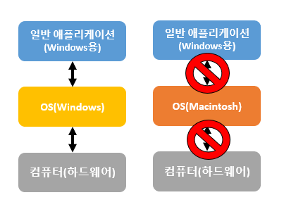
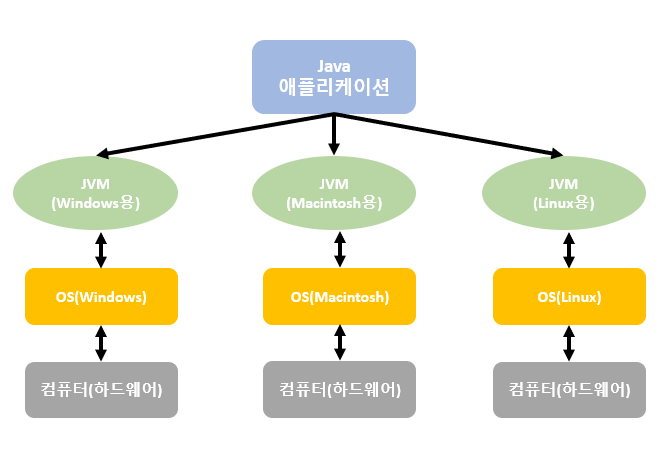
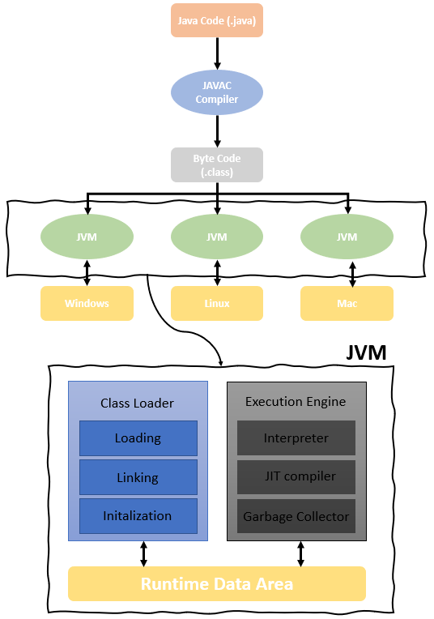
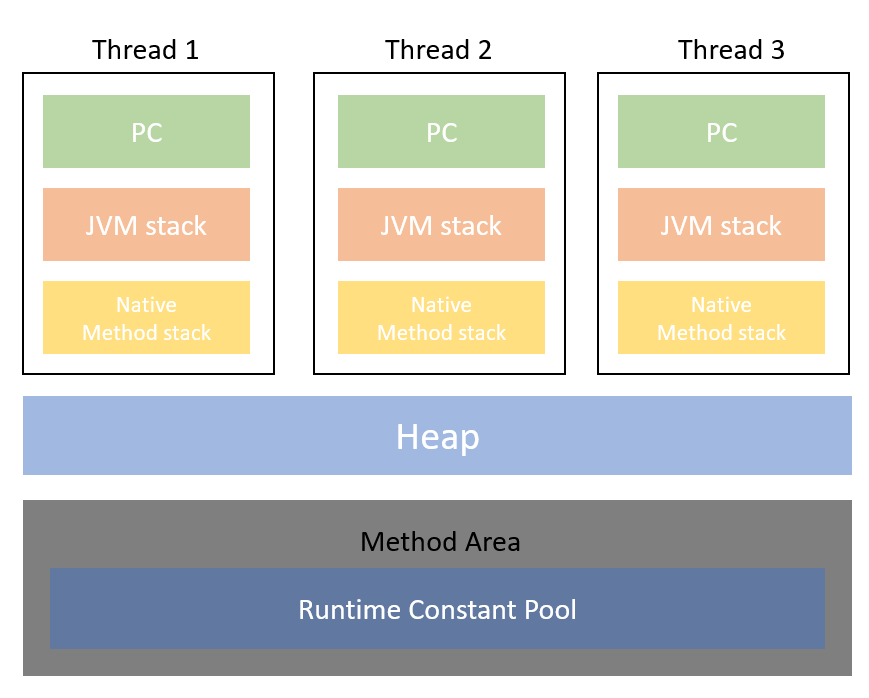
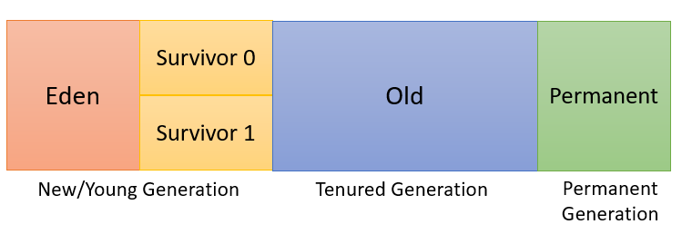

## **JVM 이란?**

-   **Java Virtual Machine** 의 약자
-   **자바 가상 머신** (가상 컴퓨터, 실제 컴퓨터는 아닌 소프트웨어로 만들어진 컴퓨터)
-   **자바와 운영체제 사이에서 중개자 역할**을 수행
-   자바 바이트 코드를 실행하기 위한 기계
-   **가비지 컬렉터**(Garbage Colletor : GC)를 사용한 **메모리 관리를 자동으로 수행**
-   레지스터 기반이 아닌 **스택 기반으로 동작**
-   **한번 작성하면, 어디서든 실행! (Write once, run anywhere) - Sun Microsystems**

windows용으로 작성 된 애플리케이션은 windows 운영체제에서만 사용가능  
만약, Macintosh 운영체제에서 사용 되려면 windows용으로 작성 된 애플리케이션을  
macintosh용으로 애플리케이션을 수정해야만 한다.  
( 해당 운영체제에 맞게 다시 컴파일 해야함 )

Java는 여러 운영체제별로 JVM이 만들어져 있기 때문에  
하나의 Java로 만들어 놓은 애플리케이션을  
JVM만 설치 되어 있으면 어느 운영체제에서도 실행하는데 문제가 없다.

### **Java 프로그램의 실행 단계**

1. 프로그램이 실행되면 JVM은 OS로 부터 이 프로그램이 필요로 하는 메모리를 할당 받는다.  
👉 JVM은 할당 받은 메모리를 용도에 따라 여러 영역으로 나누어서 관리한다.

2. 자바 컴파일러(JAVAC)가 자바 소스코드(.java)를 읽어들여 자바 바이트코드(.class)로 변환 시킨다.

3. Class Loader를 통해 .class 파일들을 JVM으로 로딩한다.

4. 로딩 된 .class 파일들은 Execution engine을 통해 해석 된다.

5. 해석 된 바이트 코드는 Runtime Data Areas에 배치 되어 실질적인 수행이 이루어지게 된다.  
👉 이러한 실행 과정 속에서 JVM은 필요에 따라 Thread Synchronization과 GC 같은 관리작업을 수행한다.

### **JVM 구성**

#### **Class Loader ( 클래스 로더 )**

-   JVM 내로 클래스(.class 파일)를 로드하고, 링크를 통해 배치하는 작업을 수행하는 모듈
-   Runtime 시에 동적으로 클래스를 로드
-   .jar 파일 내 저장 된 클래스들을 JVM 위에 탑재하고, 사용하지 않는 클래스들은 메모리에서 삭제
-   클래스를 처음으로 참조할 때, 해당 클래스를 로드하고 링크한다. 👉 이 역할을 클래스 로더가 수행

#### **Execution Engine ( 실행 엔진 )**

-   클래스를 실행시키는 역할
-   Class Loader가 JVM 내의 런타임 데이터 영역에 바이트 코드를 배치시키고, 이것은 실행 엔진에 의해 실행
-   자바 바이트코드( Byte Code )란?
    -   기계가 바로 수행할 수 있는 언어보다는 비교적 인간이 보기 편한 형태로 기술 된 것
-   위와 같은 바이트코드를 실제로 JVM 내부에서 기계가 실행할 수 있는 형태로 변경함

#### **Java Byte Code 👉 기계어 변환되는 방식 2가지**

-   Interpreter ( 인터프리터 )
    -   실행 엔진은 자바 바이트 코드를 명령어 단위로 읽어서 실행
    -   한 줄씩 수행하기 때문에 느림
-   JIT ( Just - In - Time )
    -   Interpreter 방식의 단점을 보완하기 위해 도입된 JIT 컴파일러
    -   인터프리터 방식(한 줄씩 수행)으로 실행하다가 적절한 시점에 바이트코드를 전체 컴파일하여,  
        네이티브 코드로 변경하고 이후에는 더 이상 인터프리팅 하지 않고 네이티브 코드로 직접 실행하는 방식  
        👉 변경 된 네이티브 코드는 캐시에 보관하기 때문에 한 번 컴파일 된 코드는 빠르게 수행할 수 있다.
    -   JIT 컴파일러가 컴파일하는 과정은 바이트코드를 인터프리팅하는 것보다 훨씬 오래걸리므로 한 번만 실행 되는 코드라면 JIT로 컴파일하지 않고 인터프리팅하는 것이 유리
    -   JIT 컴파일러를 사용하는 JVM들은 내부적으로 해당 메서드가 얼마나 자주 수행되는지 체크하고,  
        일정 정도를 넘을 때에만 컴파일을 수행한다.

#### **Garbage Collector ( G.C : 가비지 컬렉터 )**

-   GC를 수행하는 모듈(쓰레드)

#### **Runtime Data Area**

프로그램을 수행하기 위해 OS에서 할당받은 메모리 공간    
JVM이 자바 바이트 코드를 실행하기 위해 사용하는 메모리 공간    
Method Area / Heap은 모든 스레드가 공유

-   **PC Register**
    -   Thread가 시작될 때 생성 👉 스레드마다 하나 씩 존재
    -   각 스레드는 메서드를 항상 실행하고 있고, PC는 그 메서드 안에서 몇 번째 줄을 실행해야 하는지 나타내는 역할
    -   Thread가 어떤 부분을 어떤 명령으로 실행해야할 지에 대한 기록을 하는 부분  
        👉 현재 수행 중인 JVM 명령의 주소를 갖는다.
-   **JVM stack 영역**
    -   프로그램 실행과정에서 임시로 할당되었다가 메소드를 빠져나가면 바로 소멸되는 특성의 데이터를 저장하기 위한 영역
    -   각종 형태의 변수나 임시 데이터, 스레드나 메소드의 정보를 저장
    -   메소드 호출 시 마다 각각의 스택 프레임 생성
    -   메소드 수행이 끝나면 프레임 별로 삭제
    -   메소드 안에서 사용되는 값들(Local Variable array, Operand Stack, Frame Data) 저장
    -   다시 호출 된 메소드의 매개변수, 지역변수, 리턴 값 및 연산 시 일어나는 값들을 임시로 저장
-   **Native Method stack ( 네이티브 메소드 스택 )**
    -   자바 프로그램이 컴파일 되어 생성되는 바이트 코드가 아닌 실제 실행할 수 있는 기계어로 작성된 프로그램을 실행시키는 영역
    -   Java가 아닌 다른 언어로 작성된 코드를 위한 공간
    -   Java Native Interface를 통해 바이트 코드로 전환하여 저장
    -   일반 프로그램처럼 커널이 스택을 잡아 독자적으로 프로그램을 실행 시키는 영역
    -   Native Method Stack을 통해 C code를 실행시켜 Kernel에 접근할 수 있음
-   **Method Area ( = Class area = Static area )**
    -   클래스 정보를 처음 메모리 공간에 올릴 때 초기화되는 대상을 저장하기 위한 메모리 공간
    -   클래스 로더가 클래스 파일을 읽어오면, 클래스 정보를 파싱해서 Method Area에 저장
      변수, 메서드, 정적 변수 등이 어떤게 있는지 저장하는 것
    -   올라가게 되는 메소드의 바이트 코드는 프로그램의 흐름을 구성하는 바이트 코드
        -   자바 프로그램은 main 메소드의 호출에서 부터 계속 된 메소드의 호출로 흐름을 이어가기 때문
        -   대부분의 인스턴스의 생성도 메소드 내에서 명령하고 호출
    -   사실상 컴파일 된 바이트 코드의 대부분이 메소드 바이트코드이기 때문에 거의 모든 바이트 코드가 올라간다고 봐도 상관 없다.
    -   클래스 데이터를 위한 공간
    -   Runtime Constant Pool 이라는 별도의 관리 영역도 함께 존재
        -   상수 자료형을 저장하고 참조하고 중복을 막는 역할 수행
-   **Heap ( 힙 )**
    -   객체를 저장하는 가상 메모리 공간
    -   'new' 연산자로 생성 된 객체와 배열을 저장
    -   class area에 올라온 클래스들만 객체로 생성할 수 있음

-   New/Young Generation
    -   Eden - 객체들이 최초로 생성되는 공간
    -   Survivor 0 / 1 - Eden에서 참조되는 객체들이 저장되는 공간
-   Old
    -   New area에서 일정 시간 참조되고 있는, 살아남은 객체들이 저장되는 공간
    -   Eden 영역에 객체가 가득 차게되면 첫번째 GC가 발생
    -   Eden 영역에 있는 값들을 Survivor 1 영역에 복사하고 이 영역을 제외한 나머지 영역의 객체를 삭제
-   Permanent Generation ( 퍼머넌트 제너레이션 )
    -   생성된 객체들 정보의 주소값이 저장되는 공간
    -   Class Loader에 의해 Load 되는 Class, Method 등에 대한 Meta 정보가 저장되는 영역
    -   JVM에 의해 사용됨
    -   Reflection을 사용하여 동적으로 클래스가 로딩되는 경우에 사용됨
    -   내부적으로 Reflection 기능을 자주 사용하는 Spring Framework를 이용할 경우 이 영역에 대한 고려가 필요
-   Reflections ( 리플랙션 ) 이란?
    -   구체적인 클래스 타입을 알지 못해도 그 클래스의 메소드, 타입, 변수들에 접근할 수 있도록 해주는 자바 API
    -   컴파일 시가 아닌 실행 시에 동적으로 특정 클래스의 정보를 추출할 수 있는 프로그래밍 기법

### **면접 질문 정리**
📌 JVM 은 무엇인가요?
- Java Virtual Machine 의 약자로 자바와 운영체제 사이에서 중개자 역할을 수행하는 가상 컴퓨터입니다.

📌 JVM의 특징을 말해보세요.
- 여러 OS별로 JVM이 만들어져 있기 때문에 어느 OS에서든 JVM만 설치되어있으면 자바 애플리케이션을 실행할 수 있고, 그 과정에서 가비지 컬렉터인 GC를 사용한 메모리 관리를 자동으로 수행해줍니다.

📌 JVM 동작원리에 대해 말해보세요.
- JVM은 OS에서 애플리케이션을 실행할 때 필요한 메모리를 할당받고, 용도에 따라 여러 영역으로 나누어서 관리합니다. 먼저, JVM 내의 Class Loader(클래스로더)를 통해 컴파일 된 자바 바이트 코드(.class)를 로드하고, 로딩 된 바이트 코드를 Execution Engine(실행 엔진)을 통해 해석합니다. 이렇게 해석 된 바이트 코드는 Runtime Data Area에 배치 되어 실행되어 집니다.

📌 JVM의 역할에 대해 설명해주세요.
- JVM은 스택 기반으로 동작하고, 자바 바이트 코드를 OS에 맞게 해석 해주는 역할을 합니다. 그 과정에서 가비지 컬렉터을 통한 자동적인 메모리 관리도 해줍니다.

📌 한번에 간단히 설명
- JVM은 자바와 OS 사이에서 중개자 역할을 수행하는 가상 컴퓨터입니다. 특징은 스택 기반으로 동작되고 컴파일 된 자바 바이트 코드를 각 OS에 맞게 해석해주는 역할을 합니다. 그 과정에서 가비지 컬렉터을 통한 자동적인 메모리 관리도 해줍니다.
 
 

---
 
 

📝 참고자료

[https://steady-coding.tistory.com/305](https://steady-coding.tistory.com/305)

[https://asfirstalways.tistory.com/158](https://asfirstalways.tistory.com/158)

[https://www.youtube.com/watch?v=UzaGOXKVhwU](https://www.youtube.com/watch?v=UzaGOXKVhwU) 
